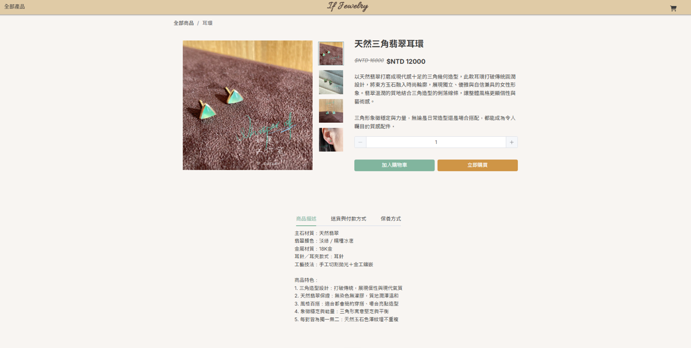
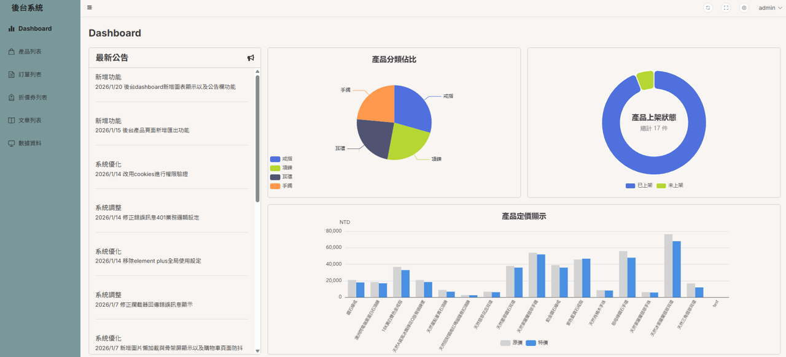
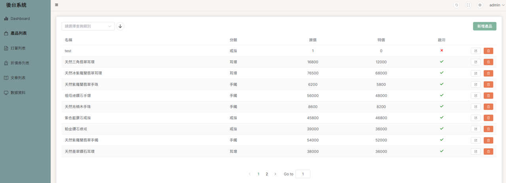

# Vue 3 電商商城專案（前台 / 後台）

一個使用Vue 3 + TypeScript開發的前後台分離電商網站，模擬實際商業情境，完整實作商品、購物車、訂單與後台管理流程。

---

## 畫面預覽

### 前台介面

<p align="center">
  
  
</p>

### 後台管理系統

<p align="center">
  
  
</p>

---

## 專案背景與目的

本專案為一個模擬電商平台，分為前台（使用者端）與後台（管理者端）：

- 前後台分離的專案設計
- 與第三方 API 串接的資料流處理
- TypeScript 型別設計與錯誤預防
- 元件化與狀態管理的實際應用
- 後台管理系統常見功能實作

---

## 使用技術

- Vue 3
- TypeScript
- Composition API
- Pinia（狀態管理）
- Vue Router
- Element Plus
- SCSS
- ECharts（資料視覺化）
- ExcelJS（報表匯出）
- RWD 響應式設計

---

## 功能實作說明

### 前台（使用者端）

- 商品列表與分類瀏覽
- 商品詳細頁
- 購物車新增 / 刪除 / 數量調整
- 套用優惠券
- 建立訂單（含表單驗證）
- 響應式版型（桌機 / 平板 / 手機）

### 後台（管理者端）

- 管理者登入驗證
- 儀表板數據視覺化（ECharts 圖表 + 公告欄）
- 商品管理（CRUD + Excel 匯出）
- 訂單管理
- 優惠券管理
- 圖片上傳與顯示
- 權限控管（未登入不可操作）

---

## 專案架構說明

```bash
src/
├── api/            # API 請求封裝（axios）
├── assets/         # 靜態資源
│   └── style/      # SCSS 與共用樣式
├── components/     # 共用元件
├── composables/    # Composition API 邏輯抽離
├── data/           # 靜態資料
├── layout/         # 前台 / 後台版型配置
├── router/         # 路由與權限控管
├── store/          # Pinia 狀態管理
├── types/          # TypeScript 型別定義
├── views/
│   ├── front/      # 前台頁面
│   └── admin/      # 後台頁面
├── utils/          # 共用工具函式
├── permission.ts   # 路由權限控管
├── setting.ts      # 全域設定
├── main.ts
└── App.vue
```

---

## 技術亮點與優化

### 效能優化

- 路由懶加載： 使用 Vue Router 異步組件技術，將各頁面打包為獨立檔案，減少首屏載入資源量。
- 圖片懶加載： 優化大量圖片下的捲動效能。
- 請求防抖優化： 針對購物車數量調整實作防抖邏輯，避免使用者連續點擊時產生大量冗餘請求，確保最終數量的準確性並減輕伺服器負擔

### 架構設計

- API 模組化封裝： 使用 Axios 二次封裝請求攔截器，處理統一的 Token 驗證與錯誤提示。
- 自定義 Composables： 將具備高度複用性的邏輯（購物車數量修改、上傳圖片等功能）抽離至 Composables 中，提升組件的可維護性。
- 環境變數配置： 透過 .env 區分開發與生產環境 API 網址，確保部署過程的工程化規範。
- TypeScript 全型別覆蓋： 嚴謹定義 API 結構、Store 狀態與 Props，從開發階段預防潛在錯誤。

### 使用者體驗

- 骨架屏： 在非同步資料載入期間顯示骨架屏，相較於傳統 Loading 圖標，顯著降低了使用者的感知等待時間。
- 空狀態處理： 針對「購物車為空」等情境，設計友好的引導畫面，提升產品完整度。
- 麵包屑導航： 在商品與文章詳情頁實作動態導航路徑，讓使用者在瀏覽深層內容時能隨時掌握當前位置，並提供快速返回分類列表的入口。

### 安全與規範

- 路由守衛： 在 permission.ts 中實作嚴謹的權限控管，確保未經授權用戶無法進入管理後台。
- Git Commit 規範： 遵循 feat, fix 等規範化提交訊息，展現良好的團隊協作意識。

### 功能擴充

- 數據視覺化： 整合 ECharts 打造管理者儀表板，提供直觀的營運數據分析（圓餅圖、長條圖）。
- 報表匯出： 實作前端 Excel 匯出功能，讓管理者能將商品資料轉換為 Excel 檔案進行備份或分析。

---

## 專案啟動方式

```bash
# 安裝套件
npm install

# 啟動開發環境
npm run dev

# 建置專案
npm run build
```
